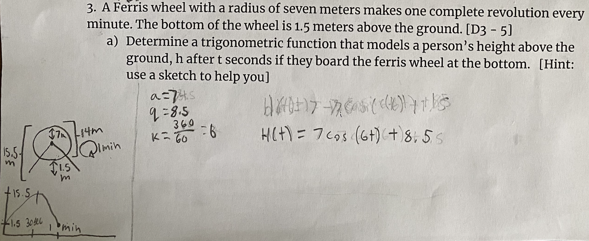

# Froggy Trig

Visualization of a Grade 11 trig assignment Abby brought to me last week about a ferris wheel and how far off the ground one would be after specific intervals.

While we got the right answer, our trig foundation felt shaky so I thought we'd simulate it. Seeing Froggy on a ferris wheel with the Cos&Sin shown will help solidify our foundation and get us ready for grade 8! 🙌
